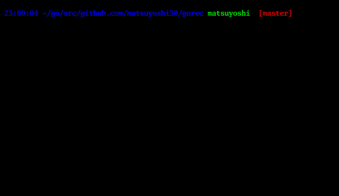

## Simple Terminal Recorder written in Go

### Usage

```
$ make build
$ ./gorec [-o output filename] [-l]
```

#### demo



sl


##### Option

| flag | Usage |
|:----|:---- 
| `-o sample` | set output filename [default: output] |
| `-l` | use login shell [default: false] |
